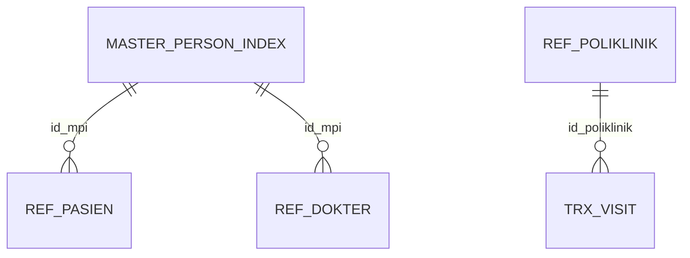

# Relasi Rawat Jalan Legacy

## Diagram confirmed

Relasi inferred tidak digambar sebagai relasi pasti: `trx_admisi.id_pasien` → `ref_pasien.id`; `trx_visit.id_admisi` → `trx_admisi.id`; `trx_visit.id_dokter` → `ref_dokter.id`; relasi antrean ke admisi/visit/poli; serta penjamin ke pasien/admisi.

| Tabel Asal | Kolom Asal | Relasi | Tabel Tujuan | Kolom Tujuan | Status | Bukti |
| ---------- | ---------- | ------ | ------------ | ------------ | ------ | ----- |
| `ref_pasien` | `id_mpi` | many-to-one | `master_person_index` | `id` | Confirmed | FK pada `KEY_COLUMN_USAGE` |
| `ref_dokter` | `id_mpi` | many-to-one | `master_person_index` | `id` | Confirmed | FK pada `KEY_COLUMN_USAGE` |
| `trx_visit` | `id_poliklinik` | many-to-one | `ref_poliklinik` | `id` | Confirmed | FK `trx_visit_ibfk_4` |
| `trx_admisi` | `id_pasien` | many-to-one | `ref_pasien` | `id` | Inferred | Nama/tipenya cocok dan sumber diindeks; tanpa FK |
| `trx_visit` | `id_admisi` | many-to-one | `trx_admisi` | `id` | Inferred | Nama/tipenya cocok dan sumber diindeks; tanpa FK |
| `trx_visit` | `id_dokter` | many-to-one | `ref_dokter` | `id` | Inferred | Nama/tipenya cocok; tanpa FK/index |
| `trx_admisi` | `id_jenis_asuransi` | many-to-one | `ref_jenis_asuransi` | `id` | Inferred | Nama/tipenya cocok; tanpa FK/index |
| `ref_pasien` | `id_jenis_asuransi` | many-to-one | `ref_jenis_asuransi` | `id` | Inferred | Nama/tipenya cocok; tanpa FK/index |
| `trx_antrian` | `id_admisi`, `id_visit`, `id_poliklinik` | many-to-one | admisi/visit/poliklinik | `id` | Inferred | Tiga sumber diindeks; tanpa FK |
| `trx_pendaftaran_online` | `id_pasien`, `id_dokter`, `id_poliklinik`, `id_trx_antrian` | kemungkinan many-to-one | tabel master/transaksi terkait | `id` | Unresolved | Nama kolom mendukung tetapi tanpa FK atau index |

## Risiko
Relasi inferred harus divalidasi dengan aturan bisnis dan sampel terkontrol yang tidak mengekspos data pribadi sebelum dipakai untuk migrasi. Tanpa FK, orphan record dan kecocokan ID lintas tabel tidak dapat dipastikan dari metadata saja.
