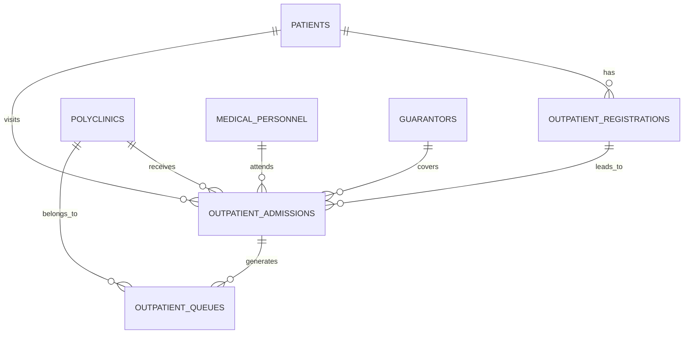

# Target ERD (Rancangan)

**Kardinalitas (Approved by Supervisor 2026-09-17)**:
- Satu outpatient registration dapat memiliki nol atau banyak outpatient admissions.
- Satu outpatient admission hanya dimiliki satu outpatient registration.
- Composite unique: `registration_id` + `polyclinic_id` + `service_date` pada admissions.
- Guarantor melekat pada admission, bukan pada patient atau registration.
