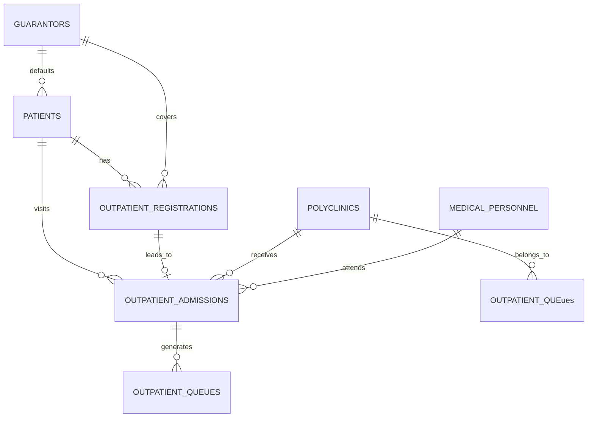

# Target ERD (Rancangan)

*Catatan*: Relasi di atas adalah rancangan target konseptual baru yang menormalisasi hubungan dari sistem lama (`simrs_lama`) untuk memisahkan entitas permanen pasien dari transaksi registrasi, admisi, dan antrean.
